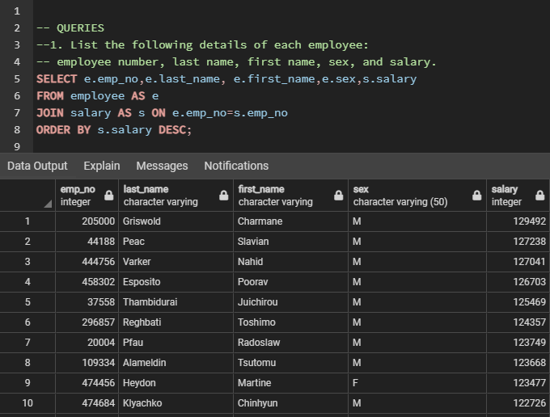

# sql-challenge

SQL Homework - Employee Data Base

_______________________

## Part 1. Data Engineering

Based on analysis of  provided 6 CSV files:
created database ERD and individual table schemas
PDF file with tables schemas - [documentation_employee_db](documentation_employee_db.pdf)

Imported each CSV file into the corresponding SQL table.
SQL file with tables schemas - [employee_schemata](employee_schemata.sql)

_________________
## Part2. Data Analysis

Queries 

SQL file with queries - [employee_query](employee_query.sql)

### 1. List the following details of each employee: employee number, last name, first name, sex, and salary.

___________________

### 2. List first name, last name, and hire date for employees who were hired in 1986.

______________________

### 3. List the manager of each department with the following information: department number, department name, the manager's employee number, last name, first name.

___________________

### 4. List the department of each employee with the following information: employee number, last name, first name, and department name.

__________________

### 5. List first name, last name, and sex for employees whose first name is "Hercules" and last names begin with "B."

___________________

### 6. List all employees in the Sales department, including their employee number, last name, first name, and department name.

_________________

### 7. List all employees in the Sales and Development departments, including their employee number, last name, first name, and department name.

_____________

### 8. In descending order, list the frequency count of employee last names, i.e., how many employees share each last name.

___________________

## Part 3 Bonus (Optional)

###  bonus query for python part.

_______________

### 1. Import the SQL database into Pandas.

Python Jupiter Notebook - [employee_db](employee_db.ipynb)
___________________

### 2. Create a histogram to visualize the most common salary ranges for employees.
#### Histogram 50 bins

-----------------

#### Histogram 200 bins

________________

### 3. Create a bar chart of average salary by title.
#### Barchart

